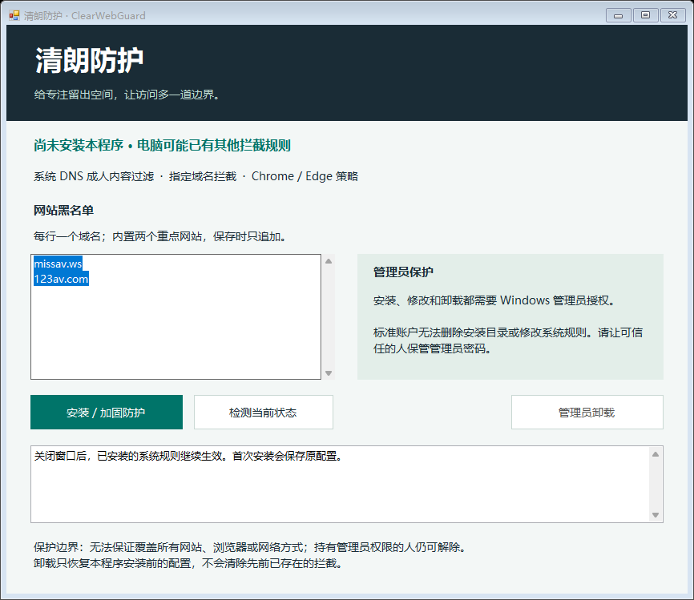

# 清朗防护 · ClearWebGuard

Windows 成人内容访问预防工具，提供中文图形界面、域名黑名单、DNS 过滤及管理员权限保护。



## 功能

- 一键配置 Cloudflare Families 成人内容过滤 DNS（IPv4 / IPv6）。
- 系统 hosts 域名屏蔽与 Chrome / Edge 机器级浏览器策略。
- 可追加的域名黑名单及过滤状态检测。
- 安装目录和配置目录限制为标准用户只读；修改及卸载需要 Windows 管理员授权。
- 修改前保存原配置，失败时尝试回滚，卸载时保留安装前已有的限制。

## 使用

适用于 Windows 10 / 11 x64，使用系统自带的 .NET Framework 4.x 和 Windows PowerShell 5.1。

1. 下载仓库中的 [ClearWebGuard.exe](ClearWebGuard.exe)，或自行编译。
2. 运行程序，点击“安装 / 加固防护”，由管理员完成授权。
3. 保存工作并重新启动浏览器，然后检测状态。

可执行文件未签名；校验值见 [SHA256.txt](SHA256.txt)。详细配置、卸载及恢复说明见[使用说明](docs/使用说明.md)。

## 保护边界

管理员仍可解除限制。本项目无法保证拦截全部色情网站、所有浏览器或所有网络访问方式。需要防止本人轻易解除时，应日常使用标准账户，由可信任的人保管独立管理员账户。

不隐藏进程、不自我重装、不修改用户密码、不禁用安全软件。关闭管理界面后，已配置的系统规则仍然存在。DNS 查询交由 Cloudflare 处理，本程序不收集浏览历史。

## 构建与验证

在项目根目录使用 PowerShell：

```powershell
& '.\源码\build.ps1'
& '.\源码\test-engine.ps1'
```

构建脚本使用 Windows 自带 C# 编译器生成根目录 EXE。重新构建后请重新生成 SHA256 校验值。

隔离测试使用模拟 DNS、临时 hosts 文件和随机 HKCU 注册表键，覆盖重复安装、域名添加、错误回滚及卸载恢复。测试不会更改真实系统 DNS 或 hosts。

目前已完成编译、界面渲染检查和隔离测试；尚未完成跨设备兼容性验证和真实标准账户下的防卸载验收。

## 许可证

[MIT](LICENSE)
